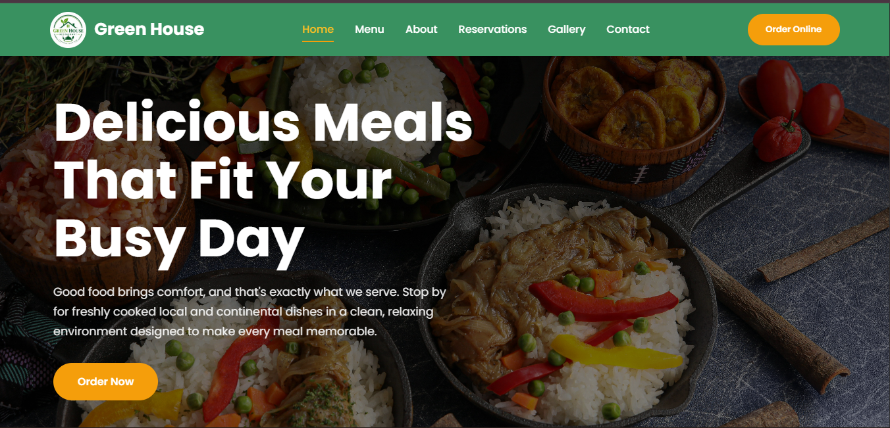

# 🌿 Green House Restaurant

A modern, responsive multi-page restaurant website built with **HTML5, CSS3, and JavaScript** as part of the AI Web Development Capstone Project.

The website showcases a fictional restaurant where visitors can browse the menu, learn about the restaurant, reserve tables, explore the gallery, and contact the restaurant.

---

## 📖 Overview

Green House Restaurant is a fictional restaurant website designed to provide users with an engaging online dining experience. The website allows visitors to explore the restaurant's menu, learn about its story and team, reserve tables, browse the gallery, and get in touch through a contact page.

The project demonstrates modern front-end web development practices, including responsive layouts, reusable components, interactive JavaScript functionality, and clean, organized code.

---

## 📸 Preview




---

## 🚀 Live Demo

**Website:** https://green-house-restaurant.netlify.app

---

## 📂 GitHub Repository

https://github.com/Ace-genesis/green-house-restaurant

---

# ✨ Features

- Fully responsive design
- Modern UI/UX
- Multi-page website
- Mobile navigation
- Interactive menu filtering
- Gallery category filtering
- Reservation form validation
- Contact form validation
- FAQ accordion
- Embedded Google Maps
- Reusable Header & Footer
- Custom notification system
- Smooth animations

---

# 📄 Pages

- Home
- Menu
- About
- Reservations
- Gallery
- Contact

---

# 🛠️ Built With

- HTML5
- CSS3
- JavaScript (ES6 Modules)
- Google Fonts
- Font Awesome
- Google Maps Embed
- Netlify (Deployment)
- Git & GitHub

---

# 📁 Project Structure

```text
green-house-restaurant/
│
├── assets/
│   ├── icons/
│   └── images/
│
├── css/
│   ├── style.css
│   ├── homepage.css
│   ├── menu.css
│   ├── about.css
│   ├── reservations.css
│   ├── gallery.css
│   ├── contact.css
│   └── responsive.css
│
├── js/
│   ├── reusable.js
│   ├── ui.js
│   ├── forms.js
│   └── script.js
│
├── pages/
│   ├── header.html
│   ├── footer.html
│   ├── menu.html
│   ├── about.html
│   ├── reservations.html
│   ├── gallery.html
│   └── contact.html
│
├── index.html
└── README.md
```

---


# 🎯 Project Requirements Met

✅ Responsive on desktop, tablet and mobile

✅ Six fully designed pages

✅ HTML5 semantic structure

✅ CSS3 modern layout

✅ JavaScript interactivity

✅ Contact form

✅ Reservation form

✅ Google Maps integration

✅ GitHub repository

✅ Online deployment


---

# 👨‍💻 Author

**Ace Genesis**

Frontend Web Developer

GitHub: https://github.com/Ace-genesis

Email:
adrielokpalo@gmail.com

---

# 📜 License

This project was created for educational purposes as part of the Web Development Capstone Project.